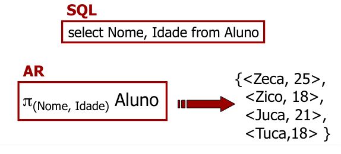
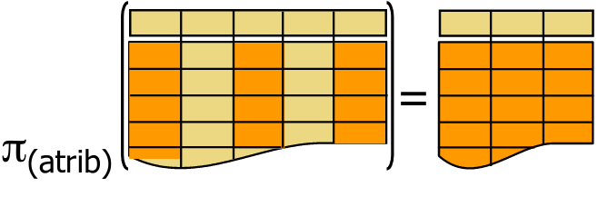

# Álgebra Relacional

Na perspectiva algébrica, uma relação é um elemento imutável e atômico.

- AR **não tem** operações de definição de relações ou de inclusão/modificação/remoção de tuplas.
- AR permite apenas definição de consultas

## Operações da Álgebra Relacional

### Relações Unárias da Álgebra Relacional
- Levam em conta a **estrutura** das relações

Basicamente 2 operações:
- seleção ($\sigma$)
- projeção ($\pi$)

#### Seleção ($\sigma$)

**Aluno = {Nome, Idade, Curso}**

**Exemplo**

**Resultado:** relação que contém o subconjunto das tuplas de R que satisfazem à condição de seleção <condição>.
**Condição de Seleção:** Operação de Comparação de um atributo da relação com:
- Uma constante
- COm outro atributo da própria seleção => comparação de valores de atributos da mesma tupla.

Seleção → **Particionamento Horizontal**
- Escolha algumas "linhas" da tabela

O operador **Seleção** é Comuntativo

$$\sigma_{(cond 1)}(\sigma_{(cond 2)}(… \sigma_{(cond n)} (R))) = \sigma_{((cond 1) AND (cond 2) AND … (cond n))}(R)$$

Operador Seleção:
- Aplicado a cada tupla da relação R
- (grau de $\sigma_{(condicao)}(R) =$ (grau de R))
- $|\sigma_{(cond)}(R)| \leq |R|$

#### Projeção

- Selecione nome e idade dos Alunos

$\pi_{(atributos)}R$

- resultado: relação que tem apenas os atributos indicados na lista de <atributos>
- <atributos>: subconjunto do conjunto de atributos da relação

O resultado de uma operação de projeção é uma relação --> não há tuplas repetidas

- Por definição, tuplas repetidas são eliminadas
    - se lista de _atributos_ contém uma chave da relação --> resultado naturalmente não tem tuplas repetidas
    - se lista de _atributos_ não contém chave --> tuplas repetidas são eliminadas, se for o caso

- Particionamento vertical: escolha algumas "colunas" da tabela

Operador de Projeção:
- não comutativo
- se _lista B_ contém _Lista A_, então vale a igualdade:
    - $\pi_{lista A}(\pi_{Lista B}(R)) = |<lista>|$
    - $|\pi_{lista}(R)| \leq |R|$
    
 #### Assignment
 
 

